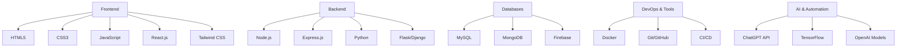

# DyexaHub - IT Profile Hub


---

# 👋 Welcome to DyexaHub

Hey there! I am **Dyexa**, an **Information Systems student** diving deep into the IT universe. Here, you'll find a chaotic, dynamic, and interactive showcase of everything I know, do, and aspire to create in the IT world.

---

## 🧩 Profile Overview

| Attribute | Details |
|-----------|--------|
| **Name** | Dyexa Hub |
| **Location** | Balikpapan City, Indonesia |
| **Education** | S1 Information Systems |
| **Role** | IT Student, Junior Trader, Business Consultant |
| **Focus** | Networking, Web Dev, AI Tech, Hypercars Lifestyle |

---

## 💻 Tech Stack & Skills

### Programming & Development



### Networking & Systems

- **Cisco Packet Tracer** - Networking simulation
- **Wireshark** - Network analysis
- **VMware** - Virtualization
- **Linux Admin** - Basic server management
- **Bash & PowerShell Scripting**

### Trading & Business Consulting

- **Fundamental Analysis**
- **Technical Analysis**
- **Market Trend Analysis (Uptrend/Downtrend)**
- **Client Advisory & Financial Guidance**

---

## 📈 Performance Metrics

```mermaid
radialBarChart
  title Performance Overview
  [Coding Skills, 90]
  [Networking, 85]
  [AI/ML, 75]
  [Trading Analysis, 80]
  [Business Consulting, 70]
```

---

## 🎨 Interactive Visual Components

### Animated Skill Bars

```html
<div class="skill-bar">
  <span style="width:90%">Coding Skills</span>
</div>
<div class="skill-bar">
  <span style="width:85%">Networking</span>
</div>
<div class="skill-bar">
  <span style="width:75%">AI & ML</span>
</div>
<div class="skill-bar">
  <span style="width:80%">Trading Analysis</span>
</div>
<div class="skill-bar">
  <span style="width:70%">Business Consulting</span>
</div>
```

### Dynamic Cards & Icons

| Skill | Icon | Level |
|-------|------|-------|
| HTML |  | Advanced |
| CSS |  | Advanced |
| JS |  | Advanced |
| React |  | Intermediate |
| Node.js |  | Intermediate |
| Python |  | Intermediate |
| Docker |  | Beginner |

---

## 🌐 Socials & Links

[](https://github.com/DyexaHub)
[](https://linkedin.com/in/Dyexa)
[](https://instagram.com/DyexaHub)

---

## ⚡ Fun Chaos Visuals

- Particles.js background integration
- Glowing neon borders on hover
- Interactive terminal simulation inside README
- Animated charts with chart.js via GitHub Pages preview

```javascript
// Particle.js Example for GitHub Pages
particlesJS("particles-js", {
  particles: {
    number: { value: 100 },
    color: { value: "#00ff99" },
    shape: { type: "circle" },
    size: { value: 3 },
    move: { speed: 3 }
  }
});
```

---

## 🏎 Lifestyle Section

- Hypercars enthusiast
- Elite sports tracking
- Productivity + IT meets luxury lifestyle


---

## 📚 Learning & Projects

| Project | Tech | Status |
|---------|------|--------|
| Personal Portfolio | React, Tailwind, JS | Completed |
| AI Chatbot | Python, OpenAI API | Ongoing |
| Trading Dashboard | Node.js, Chart.js | In Progress |
| Networking Lab Sim | Cisco Packet Tracer | Completed |

---

## ⚡ Next Level Features (Ideas for README Enhancement)

- Real-time GitHub stats with dynamic charts
- Interactive code playground snippets
- GitHub Actions badges for project deployment status
- Animated badges for skill progress
- Night-mode & light-mode toggle via CSS hacks

---

### 🚀 Summary
DyexaHub is not just a README, it's a **living IT portfolio**, chaotic, flashy, interactive, and comprehensive. Perfect for making a GitHub profile stand out and attract like-minded IT enthusiasts and collaborators.


---

*Built with chaos, creativity, and code.*
