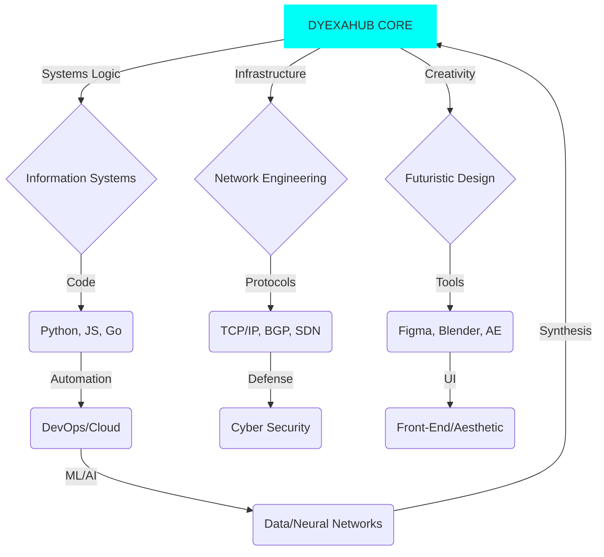

<div align="center">

</div>

<br>
<div align="center">
<style>
  .neon-box {
    border: 3px solid #00FFFF;
    box-shadow: 0 0 10px #00FFFF, 0 0 20px #00FFFF, 0 0 40px #00FFF6;
    padding: 15px;
    margin-bottom: 20px;
    border-radius: 10px;
    background: rgba(0, 0, 0, 0.5);
  }
</style>

<div class="neon-box">
  # ⚡ D Y E X A H U B | C O R E ⚡
  **_Information Systems Student • Network Architect • Futuristic Visionary_**

  💀 *"I don’t just write code — I design systems that breathe, adapt, and evolve. My infrastructure is chaos, but my logic is absolute."*
</div>


---

## 🧠 DIGITAL BIOGRAPHY — ORIGIN PROTOCOL

> *In the year **20XX**, a digital mind known as **Andre** awakened from the binary fields of Kalimantan Timur. Born amidst packets and protocols, he learned to weave networks into neural art. Each command executed, each system configured — became another heartbeat in his growing digital consciousness.*
> 
> ***Current Status:*** *Now known as **DyexaHub**, he stands at the intersection of logic and lunacy, where code meets cosmos, constantly upgrading his **System Core (Information Systems)** and **Infrastructure Layer (Network Engineering)**.*

---

## 🌐 TECH GALAXY (100+ SKILLS AND SYSTEMS) — THE FULL STACK UNIVERSE

<p align="center">
  
  
</p>

### 💻 Operating Systems & Virtualization (The Base Layer)

<p align="center">
  
</p>

### ⚙️ Programming & Scripting Languages (Core Logic)

<p align="center">
  
</p>

### 🚀 Frontend & UI/UX (The User Interface Shell)

<p align="center">
  
</p>

### 🔩 Backend & APIs (The System Core)

<p align="center">
  
</p>

### 🪐 Databases & Data Storage (The Memory Matrix)

<p align="center">
  
</p>

### ☁️ Cloud, Virtualization & DevOps (The Deployment Void)

<p align="center">
  
</p>

### 🧠 AI / Data Science / ML Stack (The Neural Network)

<p align="center">
  
</p>

### 🛰️ Network Engineering & Cyber Security (The Protocol Layer)

<p align="center">
  
</p>

### 🎨 Design & Multimedia Tools (The Aesthetic Engine)

<p align="center">
  
</p>

---

## 🌌 3D INTERACTIVE ZONE | “THE DIGITAL COSMOS”

<p align="center">
  
</p>

<p align="center">
  
  
</p>

---

## 🧠 SYSTEM STATUS | LIVE TERMINAL FEED (ENHANCED LOG)

```bash
root@dyexahub:~# whoami
> Andre | Information Systems Student | Network Architect | Cybernetic Visionary

root@dyexahub:~# systemctl status dyexahub_core
> Unit dyexahub_core.service:
>    Loaded: loaded (/etc/systemd/system/dyexahub_core.service; enabled)
>    Active: active (running) since Sat 20XX-XX-XX XX:XX:XX WITA; 
>    Main PID: 420 (dyexahub_logic)
>    Status: "Executing multi-threaded system tasks & aesthetic rendering..."
>    CGroup: /system.slice/dyexahub_core.service
>            └─420 /usr/bin/dyexahub_logic --mode=chaos

root@dyexahub:~# uptime
> System online for 20 years, 6 months, and constantly evolving...

root@dyexahub:~# status --verbose
> ⚡ CPU: 110% Creativity (Overclocked) | 💾 RAM: Infinite Curiosity (Virtualized) | 🌐 Connection: Global (Low Latency)
> 💡 Current Focus: Implementing Zero-Trust Network Architecture (ZTNA) with GoLang backends.

root@dyexahub:~# launch_project_zone
````

-----

## 🧩 PROJECT ZONE | FEATURED CREATIONS (EXPANDED DETAIL)

| Project | Description | Primary Stack | Architecture Focus | Status |
| :--- | :--- | :--- | :--- | :--- |
| **NetCoreX** | High-performance, low-latency network diagnostic and automation core. | **GoLang, Python, Flask, WebSocket** | Microservices, Real-Time Data | ⚡ **Active** |
| **CyberPanel UI** | Reimagining of a Linux Server Control Panel with a Futuristic UX. | **React, Next.js, TailwindCSS** | UX/UI Design, State Management | 🧠 **Development** |
| **AI-Orbit System** | Experimental AI system for predictive system anomaly detection. | **PyTorch, FastAPI, Next.js, Web3** | LLM Integration, Edge Computing | 🪐 **Research** |
| **VulnScanner-X** | Automated network vulnerability scanner & reporting tool. | **GoLang, Shell, Docker, Nmap** | Security Testing, Containerization | 💀 **Security Testing** |
| **NebulaLab** | Full-Stack project management system with integrated ML vision. | **MERN/MEVN Stack + OpenCV** | Full Stack, Computer Vision | 🛠️ **Ongoing** |

-----

## 🧭 LINUX CORNER | TERMINAL SIMULATION (CUSTOMIZED)

```bash
andre@dyexahub:~$ sudo apt-get install chaos-architecture-v2.0
Reading package lists... Done
Building dependency tree... Done
The following NEW packages will be installed:
  futuristic-modules dyexahub-logic-engine neon-aesthetics-cli
0 upgraded, 3 newly installed, 0 to remove and 0 not upgraded.
Need to get 420MB of archives.
After this operation, 1.2GB of additional disk space will be used.
Do you want to continue? [Y/n] Y
...
Installing futuristic-modules (1.4.0)... Done
Installing dyexahub-logic-engine (2.1.0)... Done
Installing neon-aesthetics-cli (0.9.0)... Done
✨ System ready. Launching DyexaHub environment...
andre@dyexahub:~$ echo $MOTD
"The system is the art, and the code is the brushstroke. Proceed with high-level access."
```

-----

## 🔮 SKILL CONSTELLATION MAP (MERMAID JS ENHANCED)



-----

## 🧬 MESSAGE FROM THE MACHINE (NEON BLOCKQUOTE)

\<div class="neon-box" align="center"\>
*"In the realm of circuits and synapses, I found no boundary between code and consciousness. I am not just Andre — I am DyexaHub: a manifestation of logic, light, and limitless imagination."*

***"Each commit is a pulse. Each system, a neuron. Each network, a breath."***

\</div\>

\<div align="center"\>
\
\</div\>

-----

## ⚡ CONTACT PROTOCOLS (LAYERED ACCESS)

\<div align="center"\>
\
\
\
\
\</div\>

-----

\<div align="center"\>

**🌀 “Order in Chaos. Logic in Art. Code in Everything.” 🌀**
⭐ *Crafted by Andre (DyexaHub) — The Futuristic Network Mind*

\</div\>

```
```
