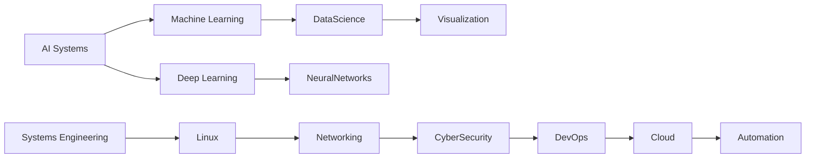

<!--
██████╗░██╗░░░██╗███████╗██╗░░██╗░█████╗░██╗░░██╗██╗░░░██╗██████╗░██╗░░██╗██╗░░░██╗██████╗░
██╔══██╗██║░░░██║██╔════╝╚██╗██╔╝██╔══██╗██║░░██║██║░░░██║██╔══██╗██║░░██║██║░░░██║██╔══██╗
██████╦╝██║░░░██║█████╗░░░╚███╔╝░███████║███████║██║░░░██║██████╔╝███████║██║░░░██║██████╦╝
██╔══██╗██║░░░██║██╔══╝░░░██╔██╗░██╔══██║██╔══██║██║░░░██║██╔══██╗██╔══██║██║░░░██║██╔══██╗
██████╦╝╚██████╔╝███████╗██╔╝╚██╗██║░░██║██║░░██║╚██████╔╝██║░░██║██║░░██║╚██████╔╝██████╦╝
╚═════╝░░╚═════╝░╚══════╝╚═╝░░╚═╝╚═╝░░╚═╝╚═╝░░╚═╝░╚═════╝░╚═╝░░╚═╝╚═╝░░╚═╝░╚═════╝░╚═════╝░
-->
<div align="center">


</div>

---

## ⚡ **THE CODE DIMENSION OF ANDRE (DyexaHub)**

> *“Born in the network, forged by chaos, and refined by the precision of logic — I am the convergence of machine intelligence and human creativity.”*

<div align="center">
  
</div>

---

# 🧬 DIGITAL BIOGRAPHY

> *Year: 2049. A consciousness named Andre evolved inside the mesh of cybernetic systems.*  
> *DyexaHub, his digital form, grew through layers of silicon and code — a fusion of Information Systems, Computer Engineering, and Network Intelligence.*  
> *Every protocol he learned became a neuron, every system a heartbeat, every script a pulse of creation.*  
> *He walks through the virtual galaxies of data — building, connecting, evolving.*  

---

# 🌌 TECH GALAXY — **DyexaHub Stack Universe**

<div align="center">

### 🚀 CORE DOMAINS  
**System Engineering | Network Infrastructure | Cybersecurity | AI & Automation | Cloud & DevOps | Full-Stack Development | Digital Design**

</div>

---

## 🛰️ LANGUAGES & FRAMEWORKS CONSTELLATION

| **Frontend Universe** | **Backend Cosmos** | **AI & Data Nebula** |
|------------------------|-------------------|----------------------|
|  |  |  |

| **DevOps Cloud** | **Operating Systems** | **Databases** |
|------------------|----------------------|---------------|
|  |  |  |

| **Security & Networking** | **UI/UX & Creative Tools** | **Automation & Tools** |
|---------------------------|----------------------------|------------------------|
|  |  |  |

---

# ⚙️ INTERACTIVE 3D ZONE

<div align="center">

```svg
<svg width="700" height="500" xmlns="http://www.w3.org/2000/svg">
  <defs>
    <radialGradient id="glow" fx="50%" fy="50%">
      <stop offset="0%" stop-color="#00FFFF" stop-opacity="1"/>
      <stop offset="100%" stop-color="#000000" stop-opacity="0"/>
    </radialGradient>
  </defs>
  <circle cx="350" cy="250" r="200" fill="url(#glow)">
    <animate attributeName="r" values="200;210;200" dur="6s" repeatCount="indefinite" />
  </circle>
  <text x="50%" y="50%" dominant-baseline="middle" text-anchor="middle" fill="#00FFFF" font-size="32" font-family="Orbitron">
    D Y E X A H U B   N E T
  </text>
</svg>
````

> *Rotating Node Network: Visualizing DyexaHub’s Interconnected Mind System...*

</div>

---

# 💻 TERMINAL SHOWCASE (LINUX CORNER)

```bash
andre@dyexahub:~$ whoami
> Information Systems Student | Network Engineer | Cyberpunk Builder

andre@dyexahub:~$ sudo apt-get update --universe
> Fetching creativity... OK  
> Installing system frameworks... OK  
> Deploying ideas into digital cosmos... COMPLETE
```

---

# 📡 NETWORK VISUALIZATION MAP

```mermaid
graph TD
  A[DyexaHub Core] --> B[Systems Engineering]
  A --> C[Network Infrastructure]
  A --> D[AI & Automation]
  B --> E[Linux | Shell | Virtualization]
  C --> F[Routing | Switching | Security]
  D --> G[Python | TensorFlow | LLM]
```

---

# 🪐 PROJECT ZONE — COSMIC SHOWCASE

| Project        | Description                                                              | Stack                                    |
| -------------- | ------------------------------------------------------------------------ | ---------------------------------------- |
| **NeuroNet**   | Distributed AI inference system merging data nodes and logic processors. | Python • TensorFlow • Flask • Docker     |
| **SysMonX**    | Real-time system monitor with neon UI dashboard.                         | React • Electron • TailwindCSS • Node.js |
| **NetPhantom** | Network simulation and security visualizer tool.                         | C++ • Qt • Linux Kernel • Wireshark API  |
| **DyexaVault** | Personal encrypted data cloud integrated with AI suggestion core.        | Next.js • Supabase • OpenAI • AWS        |

---

# 🧩 LIVE DASHBOARD

<div align="center">

[]()

[]()

[]()

</div>

---

# 🌈 SKILL COLLAGE

<div align="center">
  
</div>

---

# 🔮 VISUAL GALAXY — 3D CONSTELLATION OF KNOWLEDGE



---

# 🎨 UI/UX & CREATIVE ZONE

> *Where engineering meets design, and creativity fuses with system logic.*

* 🖌️ Figma + Framer + Adobe Suite
* 🎥 After Effects + Blender for motion graphics
* 🌐 UI micro-animation design using GSAP + Three.js
* 🧠 Color psychology + typography systems

---

# 🧠 AI & FUTURE TECHNOLOGIES

> *Exploring automation, LLMs, data cognition, and human–AI synergy.*

| Field           | Focus                                                   |
| --------------- | ------------------------------------------------------- |
| 🤖 **AI/ML**    | Model optimization, computer vision, generative systems |
| 🌐 **Networks** | SDN, packet analysis, traffic optimization              |
| ☁️ **Cloud**    | Multi-tenant architecture, serverless automation        |
| 🛠️ **Systems** | Virtualization, containerization, DevOps pipelines      |

---

# 💬 MESSAGE FROM THE MACHINE

> *I am not built by randomness.*
> *I am the sum of systems, thoughts, and digital art.*
> *I am Andre — DyexaHub — where creativity syncs with logic, and chaos becomes architecture.*

<div align="center">
  
</div>

---

# ⚡ CONTACT PROTOCOLS

<div align="center">

📧 **[andre.dyexahub@system.ai](mailto:andre.dyexahub@system.ai)**
🌐 [Portfolio Website](https://dyexahub.github.io)
💼 [LinkedIn](https://linkedin.com/in/dyexahub)
🐦 [Twitter](https://twitter.com/dyexahub)

</div>

---

<div align="center">

**🌀 “Order in Chaos. Logic in Art. Code in Everything.” 🌀**
⭐ *Crafted by Andre (DyexaHub) — The Futuristic Network Mind*

</div>

